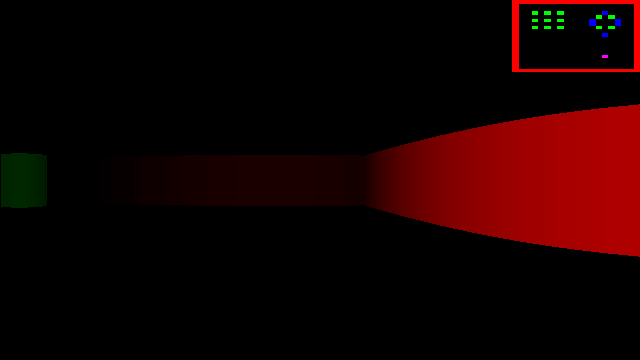

# Rustic FPS
There's a pun in there somewhere and I'm not the one who's going to find it.

This is a simple à la Wolfenstein 3D game/demo/learning project with the main 
goal of trying out rust. Also, due to boredom I decided to do the rendering
on CPU. That is the CPU creates a texture and passes it to SDL to draw it on
the screen.

## Preview 

### Prerequisites
SDL2 is required for this to work. It should be as simple as `cargo build`.

### Todos
- ~~Get it actually rendering something~~
- Get rid of the fisheye effect
- For God's sake, make it render at more than 120 fps on my laptop at FHD, is this
  too much to ask out of this plate of spaghetti?
- Make an actual game out of it?
- Clean up the mess that is this entire codebase

### Licence 
This project is licenced under MIT Licence - see the [LICENCE](LICENCE) file for details.
